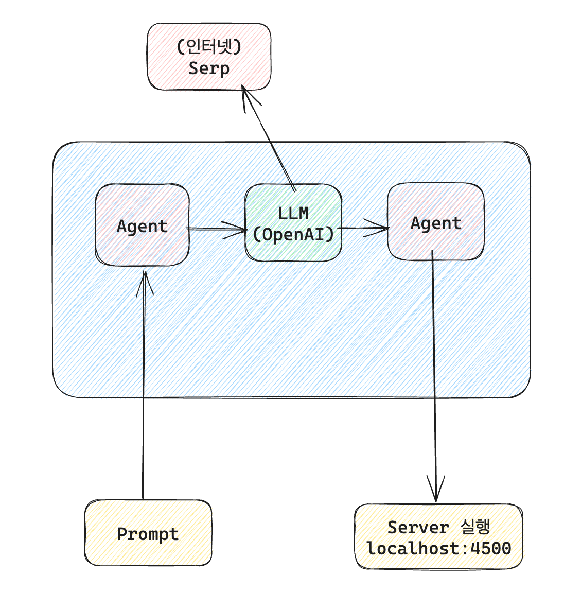

# develop-agent

- LangChain 을 이용하여 `ZERO_SHOT_REACT_DESCRIPTION`  에이전트를 생성하고, `PythonREPLTool` 툴을 생성했습니다. `llm` 은  `gpt-3.5-turbo` 를 이용하였습니다. 1,2,3 번은 해당 구조로 프롬프트에 맞는 파이썬 코드를 실행하도록 하였습니다.
- [localhost](http://localhost) 로 실행되도록 프롬프트를 주었지만 잘 되지 않는 경우가 많았습니다. `uvicorn` 을 사용하라고 직접적으로 명시해주는 방식으로 해결하였습니다.
- neumorphism 와 tetris 는 단순히 프롬프트를 넣어서 코드 작성이 되지 않았습니다. SerpAPI 를 이용하여 관련된 정보를 검색하도록 해주고 이 정보를 기반으로 파이썬 코드를 작성하게 시키니 더 잘 작성하는 것을 확인하였습니다. 하지만 이 코드를 저장하고 [localhost](http://localhost) 에서 실행시키는 명령이 잘 되지 않았습니다.
- html 코드를 저장하는 과정에서 `PythonREPLTool` 이 적합한 툴이 아니라는 에러가 발생하였습니다. 저장하는 방식을 구체적으로 명시해주는 방식으로 해결하려 했느나 그 다음 작업을 수행하지 못하는 문제가 발생하였습니다. 따라서 시도 자체를 많이 해서 성공되도록 하였습니다.